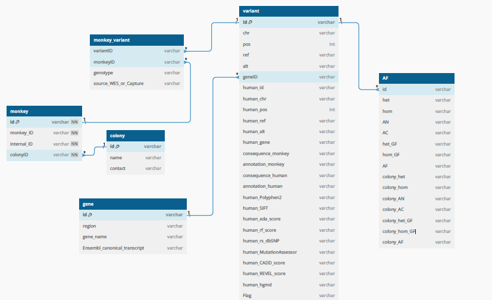
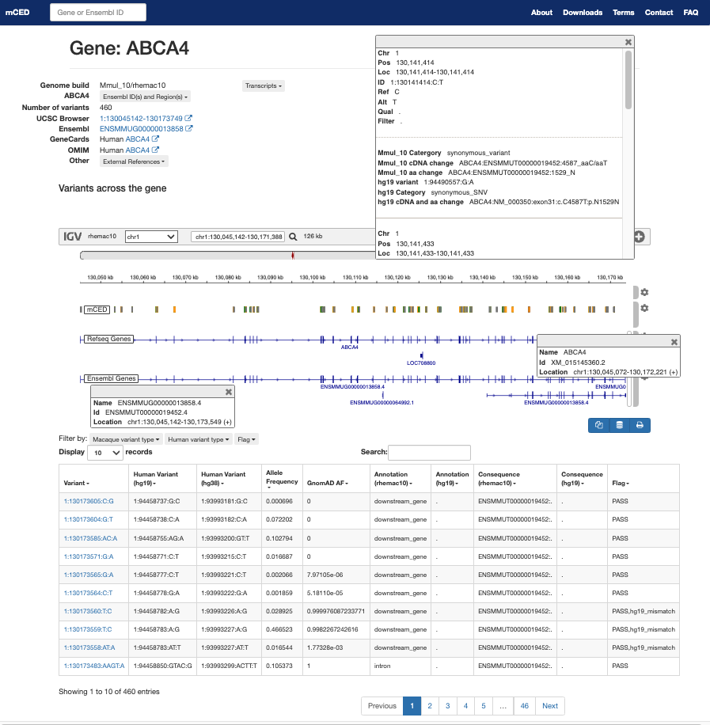
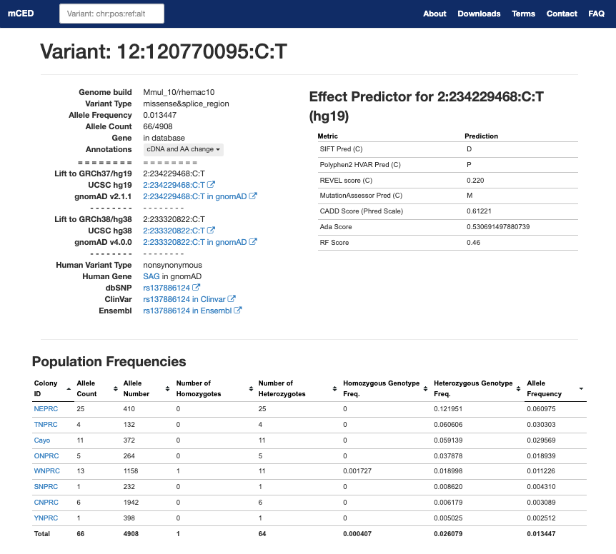

# mCED

This repository contains the code used for the macaque Capture and Exome database (mCED) https://ird.research.bcm.edu/macaque

This variant browser was designed based on the ExAC browser:

Karczewski KJ, Weisburd B, Thomas B, Solomonson M, Ruderfer DM, Kavanagh D, Hamamsy T, Lek M, Samocha KE, Cummings BB, Birnbaum D; The Exome Aggregation Consortium; Daly MJ, MacArthur DG. The ExAC browser: displaying reference data information from over 60 000 exomes. Nucleic Acids Res. 2017 Jan 4;45(D1):D840-D845. doi: 10.1093/nar/gkw971. Epub 2016 Nov 28. PMID: 27899611; PMCID: PMC5210650.

## database schema

## variant browser
### gene page

### variant page

